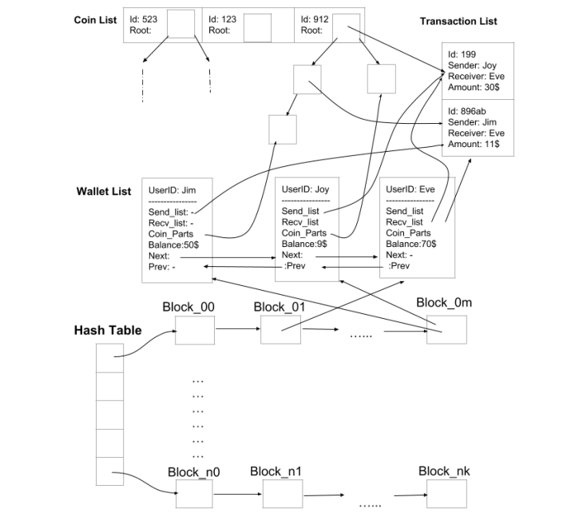

# bitcoin 1.0.0

## Introduction

This application implements a user-friendly interface for a bitcoin transactions system.
FIrst of all, given a ​**Balances File**​ containing a list of bitcoin IDs for each user, it initializes
the users’ s wallets. Each wallet contains a userID, it’s balance($) and two lists representing
his transactions as a sender and as a receiver. It also contains a list of the bitcoin parts that
he owns and their corresponding values.
After that, the application reads a ​ **Transactions File**​ , containing bitcoin transactions
between the users, that were made in the past. It carries out each transaction, if feasible,
and then updates all data.
Then, the application prompts the user to enter queries, until ‘exit’ is requested.
A user can either ask for a transaction or get statistics for either a user or bitcoin.

## How it works

Although the whole concept is simple, the implementation happens to be quite
complicated, so here we are just going to explain the main idea behind the interface
without getting into much detail.
Code happens to be very well commented, so if anyone
wants to know what really happens under the hood, taking
a look at the sources is a good idea.
Going through the Balances File, we store the bitcoin IDs of each bitcoin that appears in it
in a ​ **coin list**.​ The coin’s id and a node representing it’ s initial state are stored there, when
a part of the coin is passed to another user, this node is split into either two(if the user kept
a part) or into one(if the user passed on the whole part he owned) part(s). After a number
of transactions a ​ **tree​** is created for each coin with at most two child nodes for each
node(binary).This tree represents the bitcoin’s transfer history as you will very soon realize.
For each user of the file a wallet is created; wallets are stored in a ​**wallet list​**.

Each feasible transaction of the Transactions File, is stored in a ​**transactions list**​.
Remember that a transaction causes a node to split, so this node shall point to that
transaction. Therefore, ​**internal nodes​** of a bitcoin’s tree also represent all transfers it has
been involved in.
In addition, for each of those transactions, pointers to wallets of both participants are
stored. To do this we need ​**two hash tables**, one for the senders and one for the receivers.
Each hash table has a certain number of buckets and each of them has a list of fixed sized
blocks, the main one(header) and the overflow blocks(tail). A hash function(Universal
Hashing here) is applied on the wallet’ s user_ID, showing which bucket shall store the
wallet. Therefore, a ​**pointer**​ to the wallet is stored in the first block of the bucket having some
empty space. If all blocks are full of records(wallet pointers), an overflow block is created to
store the wallet pointer.
To get information about the transactions a user was involved in, we store a
​**list of pointers to transactions**​ of the transactions list
in his wallet, both for the bitcoins parts that he
send and for those he received. So two lists right here.
We also need to know which parts and of which bitcoin a user owns,
so a ​**list of pointers to nodes**​ (representing bitcoin parts)
is also stored in his wallet. Notice that an unspent
part of a bitcoin is represented by a ​ leaf node​.

## BitCoin Operations

In order to estimate the unspent part of a coin, we use it’s transaction history tree. Starting
from root, it can have

No children, so the coin was not passed and it’s unspent part is it’s value.
Have only a left child, so it was completely passed and it’s unspent part is 0.
Have both a left and a right child, so the owner kept a part. To find out what
happened next we apply the same rule recursively to the right child node of root.
Same pattern is followed to compute the number of transactions it was involved in. No
children means zero transactions, just a left one means 1 plus the result of applying the
same rule to the left child and in case of having both a left and a right it is 1 plus the result
of applying this rule to both of his children recursively, until reaching a leaf node.

## The lists thing

As you might have noticed, a variety of lists is used here, so implementing a ​
**generic doubly linked list** (`struct G_list`)
was probably a good idea. This structure contains as fields
the size of the type it’s going to ‘host’ plus a bunch of pointers to functions, specifying how a
list node of a certain type can be manipulated(initialized, freed etc.). By implementing those
member methods for any data type of our choice we can create a list of this particular kind.

## Conclusion

Last but not least, notice that all data of this system is stored only once without repeating
any information, using pointers in order to have direct access to all data,​
**eliminating data duplication​** as much as possible. Make sure you check out
`manual.pdf` before running this application.
Hopefully, I made things clear.
Thank you.
